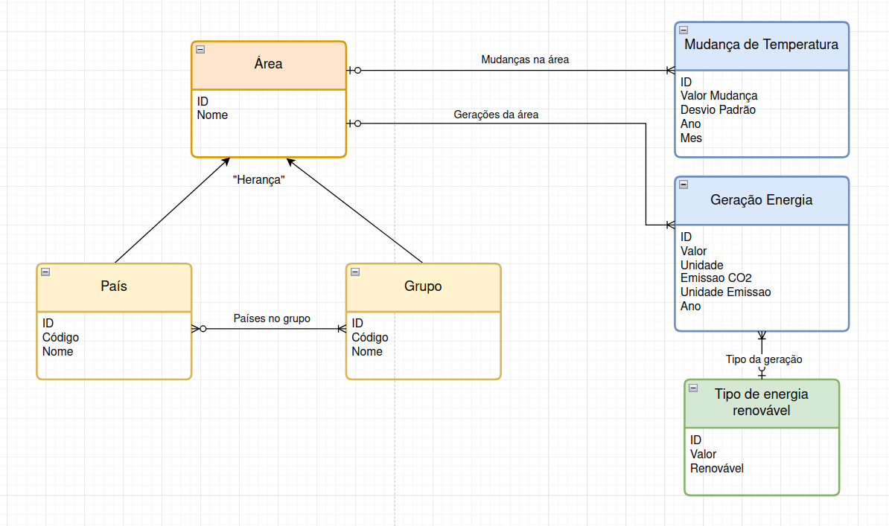
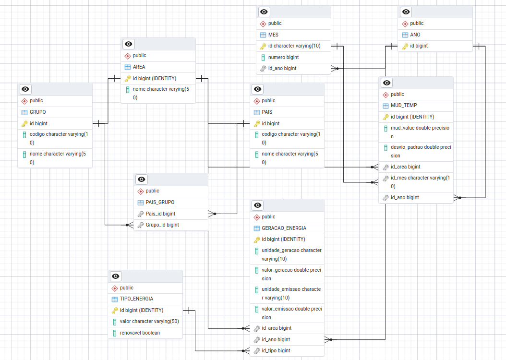

📊 Projeto de Banco de Dados — Energia Renovável e Mudança Climática

Este repositório contém os arquivos produzidos para o projeto de banco de dados da equipe, desde a modelagem até a realização de consultas SQL e análise dos dados.
👥 Integrantes (ID 1)
    Bruno Cardoso Holanda  - RA : 
    Rafael Campideli Hoyos - RA : 175100
    Lucas Palacio Almeida  - RA : 236380  

## 🧠 Modelos

### Modelo Conceitual

### Modelo Relacional

### Modelo Físico

[Acessar pasta com o modelo físico](https://github.com/Palacio-dev/Energia-renovavel-e-mudanca-climatica/tree/main/Modelos/Modelo_Fisico)

Objetivo de Desenvolvimento Sustentável: 13 - Ação contra a mudança global do clima

🗂️ Datasets Utilizados

Os dados utilizados no projeto estão disponíveis na pasta Datasets. Eles foram utilizados como base para a modelagem e para o povoamento do banco de dados.
https://www.kaggle.com/datasets/sevgisarac/temperature-change
https://ourworldindata.org/grapher/modern-renewable-prod?tab=table

    
