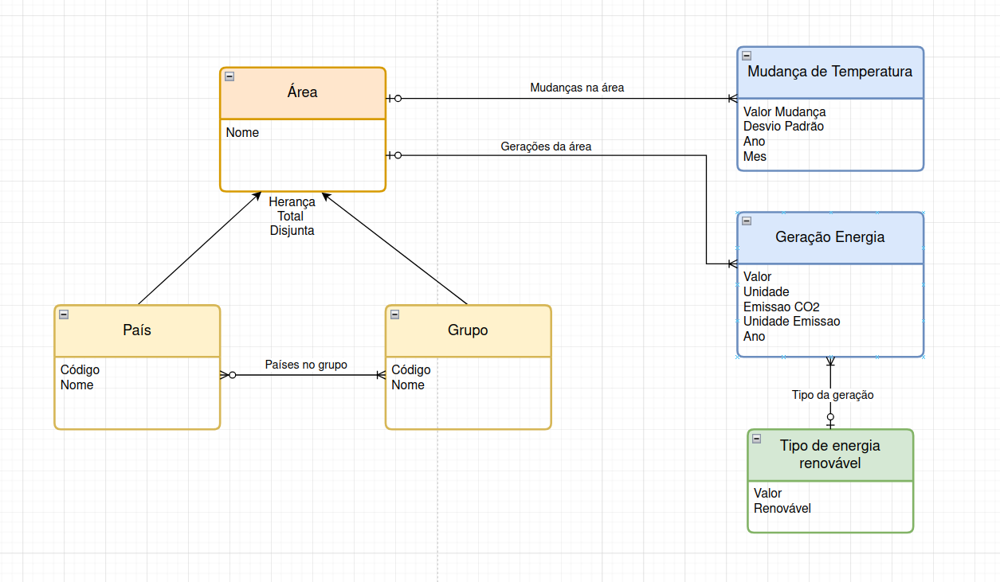
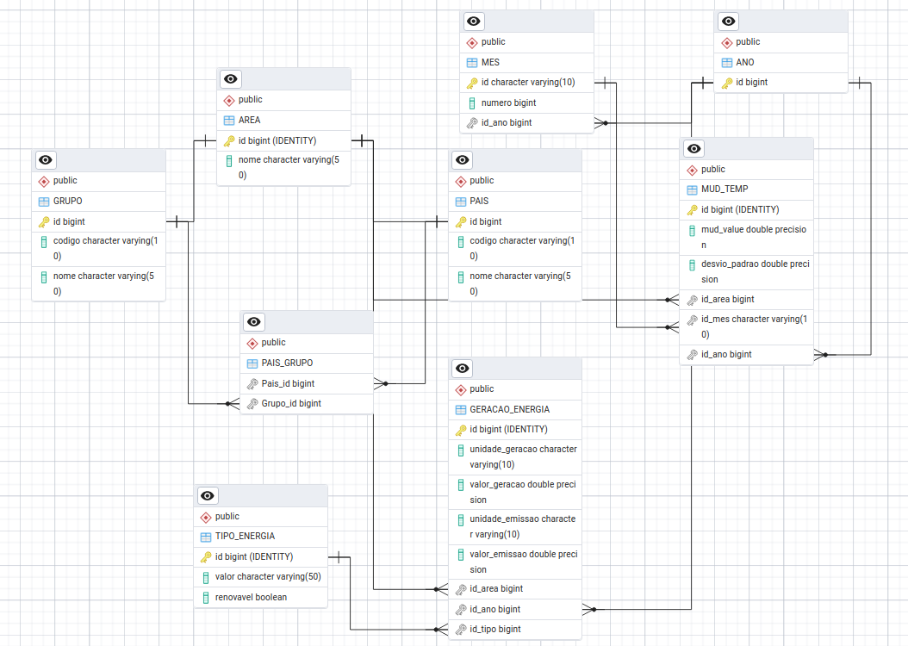

📊 Projeto de Banco de Dados — Energia Renovável e Mudança Climática

Este repositório contém os arquivos produzidos para o projeto de banco de dados da equipe, desde a modelagem até a realização de consultas SQL e análise dos dados.
Objetivo de Desenvolvimento Sustentável: 13 - Ação contra a mudança global do clima

## 👥 Integrantes (ID 1)

- Bruno Cardoso Holanda  – RA: 167542
- Rafael Campideli Hoyos – RA: 175100  
- Lucas Palacio Almeida  – RA: 236380


## 🧠 Modelos

### Modelo Conceitual



### Modelo Relacional



### Modelo Físico

[Modelo Físico](https://github.com/Palacio-dev/Energia-renovavel-e-mudanca-climatica/tree/main/Modelos/Modelo_Fisico)


## 📁 Estrutura do Repositório
```bash
.
├── 📂 Consultas
│   ├── 📄 consulta01.sql
│   ├── 📄 consulta02.sql
│   ├── 📄 consulta03.sql
│   ├── 📄 consulta04.sql
│   └── 📄 consulta05.sql
│
├── 📂 Datasets
│   ├── 📄 energia.csv
│   ├── 📄 temperature_change.csv
│   ├── 📄 tipos_energia.csv
│   └── 📂 Processamento
│       └── 🐍 gera_tipos_energia.py
│
├── 📂 Modelos
│   ├── 📂 Modelo_Conceitual
│   │   ├── 🧩 Diagrama 1.drawio
│   │   └── 🖼️ Modelo_Conceitual.png
│   ├── 📂 Modelo_Fisico
│   │   └── 💾 modelo.sql
│   └── 📂 Modelo_Relacional
│       ├── 🖼️ Modelo_Relacional.png
│       └── 📄 Modelo-Relacional
│
├── 📂 Resultado_Consultas
│   ├── 📄 consulta01.csv
│   ├── 📄 consulta02.csv
│   ├── 📄 consulta03.csv
│   ├── 📄 consulta04.csv
│   └── 📄 consulta05.csv
│
├── 📂 Scripts
│   ├── 🐍 load_data.py
│   └── 🐍 main.py
│
├── 📄 README.md
└── 📄 estrutura.txt

```


## 📊 Datasets Utilizados

- [Temperature Change - Kaggle](https://www.kaggle.com/datasets/sevgisarac/temperature-change)
- [Our World in Data - Renewable Production](https://ourworldindata.org/grapher/modern-renewable-prod?tab=table)

## 📊 Consultas SQL — Geração de Energia, Emissões e Mudanças Climáticas

Este conjunto de consultas SQL foi desenvolvido para análise de um banco de dados com informações sobre:

- Geração de energia (total e renovável)
- Emissão de CO₂
- Aumento de temperatura global
- Classificação de países por uso de energia renovável

Os dados vêm das tabelas:

- `"GERACAO_ENERGIA"`
- `"TIPO_ENERGIA"`
- `"MUD_TEMP"`
- `"AREA"`
- `"PAIS"`

---

### 🟢 Consulta 01 — Panorama Geral

**Objetivo:**  
Consolidar, por país e por ano:

- Total de geração de energia
- Total de geração de energia renovável
- Percentual renovável
- Total de emissão de CO₂
- Aumento médio de temperatura

**Observações:**

- Considera todos os anos disponíveis
- Exclui registros com geração total zero
- **Ordenação:** percentual renovável (desc), país, ano

---

### 🟢 Consulta 02 — Top Países Renováveis (Ano 2023)

**Objetivo:**  
Listar países que em **2023** geraram mais de **50%** da energia a partir de fontes renováveis.

**Inclui:**

- País
- Ano
- Total de geração
- Total renovável
- Percentual renovável
- Emissão de CO₂

**Observações:**

- Ano fixo em 2023
- Apenas países com mais de 50% renovável

---

### 🟢 Consulta 03 — Emissão de CO₂ por Tipo de Energia

**Objetivo:**  
Obter emissão total de CO₂ por:

- País
- Tipo de energia
- Ano

**Inclui:**

- País
- Tipo de energia
- Se a energia é renovável ou não
- Total de emissão de CO₂

**Observações:**

- Apenas registros com emissão positiva
- **Ordenação:** total de emissão (desc)

---

### 🟢 Consulta 04 — Emissão de CO₂ por Tipo de Energia (mesma que a 03)

**Objetivo:**  
Mesma lógica da Consulta 03.  
**Sugestão:** unificar ambas como uma consulta padrão de emissão por tipo de energia.

---

### 🟢 Consulta 05 — Aumento Total de Temperatura por País

**Objetivo:**  
Obter o aumento **total acumulado** de temperatura (°C) por país.

**Inclui:**

- País
- Aumento total de temperatura (°C), convertido de milésimos

**Observações:**

- Agrupado por país
- **Ordenação:** aumento total (desc)

---

### 🟢 Consulta 06 — Geração de Energia Não Renovável

**Objetivo:**  
Obter o total gerado de energia **não renovável**, por país e tipo de energia.

**Inclui:**

- País
- Tipo de energia
- Total gerado
- Unidade de geração

**Observações:**

- Apenas tipos de energia não renováveis
- **Ordenação:** total gerado (desc)

---

### 🟢 Consulta 07 — IDs de Países com Mais de 50% Renovável em 2023

**Objetivo:**  
Listar **os IDs** dos países que em 2023 geraram mais de 50% da energia a partir de fontes renováveis.

**Inclui:**

- ID do país (para uso em outras consultas ou visualizações)

**Observações:**

- Ano fixo em 2023
- Apenas países com >50% renovável
- IDs extraídos da tabela `"PAIS"`

---

### 🗂️ Observações gerais

- **CTEs (`WITH`)** foram utilizadas para melhorar legibilidade e performance.
- Percentuais e somas com arredondamento para melhor visualização.
- Consultas escritas para **PostgreSQL**.
- Possível extensão para parametrizar ano nas consultas 02 e 07.

---


    
