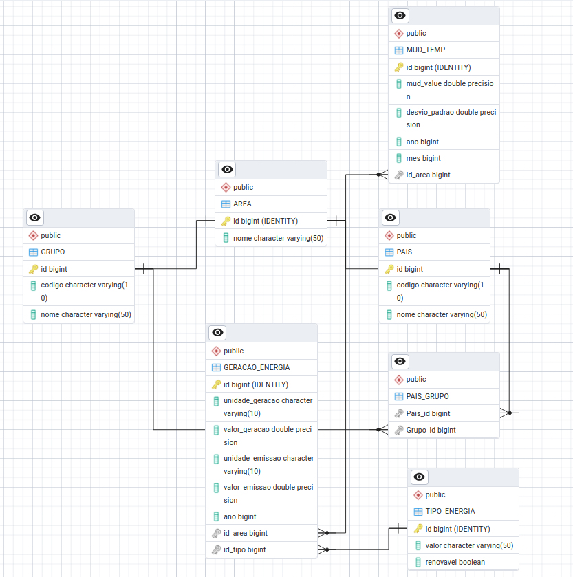

📊 Projeto de Banco de Dados — Energia Renovável e Mudança Climática

Este repositório contém os arquivos produzidos para o projeto de banco de dados da equipe, desde a modelagem até a realização de consultas SQL e análise dos dados.
Objetivo de Desenvolvimento Sustentável: 13 - Ação contra a mudança global do clima

## 👥 Integrantes (ID 1)

- Bruno Cardoso Holanda  – RA: 167542
- Rafael Campideli Hoyos – RA: 175100  
- Lucas Palacio Almeida  – RA: 236380

## 🧠 Modelos

### Modelo Conceitual

### Modelo Relacional

### Modelo Físico

[Modelo Físico](https://github.com/Palacio-dev/Energia-renovavel-e-mudanca-climatica/tree/main/Modelos/Modelo_Fisico)

## 📁 Estrutura do Repositório

.
├── Consultas
---│   ├── consulta01.sql
---│   ├── consulta02.sql
---│   ├── consulta03.sql
---│   ├── consulta04.sql
---│   └── consulta05.sql
---├── Datasets
---│   ├── energia.csv
---│   ├── Processamento
---│   │   └── gera_tipos_energia.py
---│   ├── temperature_change.csv
---│   └── tipos_energia.csv
---├── estrutura.txt
---├── Modelos
---│   ├── Modelo_Conceitual
---│   │   ├── Diagrama 1.drawio
---│   │   └── Modelo_Conceitual.png
---│   ├── Modelo_Fisico
---│   │   └── modelo.sql
---│   └── Modelo_Relacional
---│       ├── Modelo-Relacional
---│       └── Modelo_Relacional.png
---├── README.md
---├── Resultado_Consultas
---│   ├── consulta01.csv
---│   ├── consulta02.csv
---│   ├── consulta03.csv
---│   ├── consulta04.csv
---│   └── consulta05.csv
---└── Scripts
---├── ├── load_data.py
---└── └── main.py

## 📊 Datasets Utilizados

- [Temperature Change - Kaggle](https://www.kaggle.com/datasets/sevgisarac/temperature-change)
- [Our World in Data - Renewable Production](https://ourworldindata.org/grapher/modern-renewable-prod?tab=table)

    
